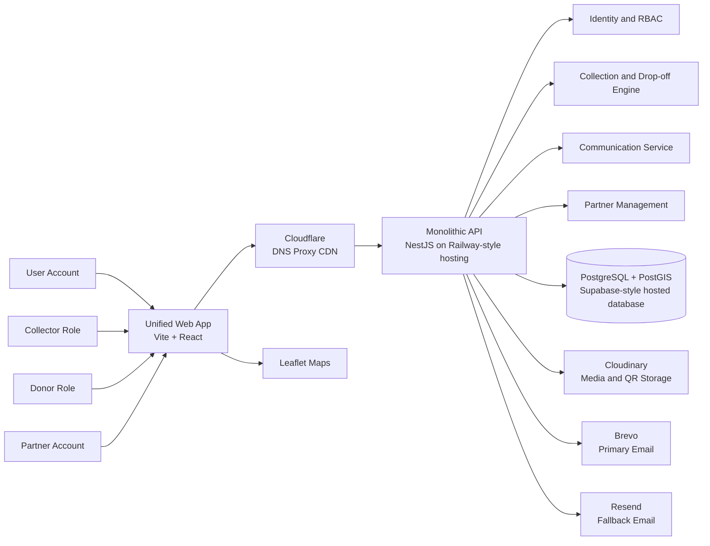

# TruCycle System Architecture & Security Design

## Purpose

This document explains how TruCycle works across the frontend and backend repositories, how the main user flows move through the platform, and which security controls protect the system.

It is based on:

- the backend NestJS codebase in this repository
- the frontend Vite + React application in `../trucycle`
- the shared visual flow design from Mermaid

The goal is to give engineering, product, and operations a single architecture reference that is grounded in the implementation rather than a generic platform diagram.

## System Summary

TruCycle is a circular economy platform for listing reusable items, matching donors and collectors, managing partner drop-off locations, enabling real-time messaging and notifications, and rewarding sustainable actions.

At a high level:

- users access a unified web application built in React
- the frontend talks to a monolithic NestJS API over HTTPS and Socket.IO
- the API persists operational data in PostgreSQL with PostGIS support
- media files and QR assets are stored in Cloudinary
- transactional email is delivered primarily through Brevo with Resend as fallback
- maps and location experiences are supported by geospatial data and Leaflet on the client

## Repositories In Scope

### Frontend

- Path: `../trucycle`
- Stack: Vite, React 19, TypeScript, React Router, Socket.IO client
- Structure: feature-first SPA with dedicated messaging and notifications features

### Backend

- Path: `./`
- Stack: NestJS, TypeORM, PostgreSQL, PostGIS, Socket.IO, Swagger
- Core modules: auth, users, items, claims, shops, messages, notifications, rewards, reviews, qr, geo

## Logical Architecture



## Deployment View

The current design intent from the shared flow visual is:

- domain registration through Afeeshost
- DNS, proxying, TLS termination, and edge protection through Cloudflare
- application hosting on a managed platform such as Railway
- managed PostgreSQL, commonly Supabase or another hosted Postgres provider with SSL enabled
- Cloudinary for public and authenticated media delivery

The repositories themselves are deployment-agnostic, but the code already assumes externalized configuration through environment variables for URLs, secrets, database connectivity, email providers, and Cloudinary credentials.

## Main Building Blocks

### 1. Unified Web Application

The frontend is a single-page application that serves the main user journeys for normal users, collectors, donors, and partners. It is structured by features, which aligns well with the backend module boundaries.

Primary responsibilities:

- registration, login, verification, and session management
- browsing and managing items
- claim and collection workflows
- partner and shop interactions
- real-time messaging
- real-time notifications
- map-assisted discovery and location flows

### 2. Monolithic Backend API

The backend is a single NestJS application composed of domain modules. This is not a microservice architecture. The design trades service isolation for delivery speed, simpler operations, and shared transactional consistency.

Primary responsibilities:

- authentication and token issuance
- role and identity management
- item listing and claim lifecycle management
- shop and partner operations
- QR generation and scanning support
- rewards and ledger tracking
- notification persistence and delivery
- messaging rooms, history, presence, and attachments
- geospatial lookup and proximity logic

### 3. PostgreSQL + PostGIS

The database is the system of record.

It stores:

- users, roles, and KYC-related fields
- items and claim relationships
- shops and geocoded partner locations
- message rooms and messages
- notifications and read state
- wallet and ledger records for rewards
- geospatial coordinates used for location-aware features

PostGIS is important because TruCycle is not only a marketplace. It also has a physical-world operating model where location affects drop-offs, shops, proximity alerts, and discovery.

### 4. Communication Integrations

The system uses two communication modes:

- synchronous REST APIs for durable record changes and list retrieval
- real-time Socket.IO channels for presence, new messages, and notification delivery

Email is asynchronous and externalized through Brevo, with Resend available as backup.

### 5. Media and QR Assets

Cloudinary is the external media boundary. It stores:

- chat image attachments
- item or profile media where enabled
- QR-related image assets
- email-linked media assets when configured

This keeps binary payloads out of the database and reduces direct static file handling in the API.

## User and Role Model

The visual design is correct in treating roles as central to the product.

Supported role concepts in the current design:

- normal customer or general user
- donor
- collector
- partner

Important behavior:

- a user can hold multiple roles
- role upgrades are supported, including upgrade to partner
- partner registration requires shop information
- authorization is enforced primarily through JWT-backed identity and module-level business rules

This role model allows TruCycle to support one account moving across multiple operational contexts without creating separate user silos.

## Core Business Flows

### Flow 1. Registration and Verification

1. The user registers from the web app.
2. The frontend sends credentials and profile data to the backend auth module.
3. The backend hashes the password and creates the user in `pending` state.
4. A verification email is sent.
5. The user verifies the token and receives access and refresh tokens.
6. Authenticated requests then use `Authorization: Bearer <JWT>`.

Security significance:

- the backend avoids email enumeration in resend and forgot-password flows
- password reset uses OTP
- JWT payload validation is enforced before protected endpoints are entered

### Flow 2. Partner Upgrade and Shop Creation

1. An existing user requests partner capabilities.
2. The backend requires shop information if no partner shop exists.
3. Shop postcode is geocoded server-side.
4. The partner role is linked to the account.
5. The updated token set reflects the expanded role set.

Security significance:

- role elevation is controlled server-side
- partner creation depends on business validation, not client trust
- geocoding is done in the backend, reducing manipulated location writes

### Flow 3. Item Listing, Claiming, and Collection

1. A donor creates or manages an item listing.
2. A collector discovers and claims the item.
3. The backend stores claim state transitions in PostgreSQL.
4. Domain events trigger notification creation.
5. On approval and collection, both donor and collector records are updated.
6. Rewards and ledger entries are created where applicable.

Security significance:

- write authority stays in the API
- notifications are derived from persisted actions
- rewards should remain tied to idempotent business events to avoid double-crediting

### Flow 4. Partner Drop-off and Location-Aware Operations

1. A user interacts with a partner shop or drop-off flow.
2. The frontend uses map UI and shop location data.
3. The backend evaluates shop data, service zones, or other geospatial attributes.
4. The resulting action is persisted and corresponding notifications are emitted.

Security significance:

- location data should be treated as business-critical input
- map rendering happens on the client, but authoritative coordinates come from the backend datastore

### Flow 5. Real-Time Messaging

1. The frontend opens a Socket.IO connection to `/messages` using the same JWT model as REST.
2. The backend verifies the token during websocket handshake.
3. Users join a direct room through `room:join`.
4. Messages are persisted before broadcast.
5. Presence updates are emitted on connect and disconnect.
6. Image messages are validated and stored through Cloudinary-backed media handling.

Security significance:

- websocket access is not anonymous
- room membership is enforced server-side
- message history remains durable even if real-time delivery is missed
- only image media types are accepted for socket attachment uploads

### Flow 6. Real-Time Notifications

1. Backend domain services create notifications in the database.
2. The notifications gateway emits `notification:new` to active sockets for the target user.
3. The frontend also uses HTTP to load missed notifications and unread counts.
4. Read state is acknowledged back over websocket or HTTP.

Security significance:

- notifications are both persistent and real-time
- unread counters are computed from durable state rather than client-side assumptions

## Trust Boundaries

There are five critical trust boundaries in TruCycle.

## Security Topology Diagram

The diagram below shows the main trust boundaries and security-relevant flows across the browser, Cloudflare edge, JWT-protected API, persistence layer, media storage, and email providers.

```mermaid
%%{init: {"layout": "elk"}}%%
flowchart TB
    classDef client fill:#eef2ff,stroke:#818cf8,color:#0f172a
    classDef edge fill:#fefce8,stroke:#facc15,color:#0f172a
    classDef app fill:#f0fdf4,stroke:#4ade80,color:#0f172a
    classDef store fill:#fdf4ff,stroke:#e879f9,color:#0f172a
    classDef ext fill:#f0f9ff,stroke:#38bdf8,color:#0f172a
    classDef secret fill:#fff7ed,stroke:#fb923c,color:#0f172a

    subgraph TB1 [Trust Boundary 1: Public Client]
        Browser[Browser / React SPA]:::client
        Jwt[JWT Access Token\nBearer header + WS auth]:::secret
    end

    subgraph TB2 [Trust Boundary 2: Edge]
        Cloudflare[Cloudflare\nDNS Proxy TLS WAF Rate Limits]:::edge
    end

    subgraph TB3 [Trust Boundary 3: Application]
        Api[NestJS Monolith API]:::app
        Guard[JWT Guard + WS Handshake Verification]:::app
        Msg[/messages namespace]:::app
        Notif[/notifications namespace]:::app
        Config[Env Secrets\nJWT secret DB creds API keys]:::secret
    end

    subgraph TB4 [Trust Boundary 4: Data and Storage]
        Db[(PostgreSQL + PostGIS)]:::store
        Cloudinary[(Cloudinary\nMedia and QR assets)]:::store
    end

    subgraph TB5 [Trust Boundary 5: External Providers]
        Brevo[Brevo\nPrimary email]:::ext
        Resend[Resend\nFallback email]:::ext
    end

    Browser -->|HTTPS REST| Cloudflare
    Browser -->|WSS Socket.IO| Cloudflare
    Browser -. stores token in client session .-> Jwt
    Jwt -->|Authorization: Bearer JWT| Cloudflare

    Cloudflare -->|Proxied TLS traffic| Api
    Api --> Guard
    Guard --> Msg
    Guard --> Notif
    Config -. signs and verifies JWTs .-> Guard

    Api -->|ORM over TLS/SSL| Db
    Api -->|Signed / authenticated uploads| Cloudinary
    Api -->|Transactional email API| Brevo
    Api -->|Fallback email API| Resend

    Cloudinary -. CDN media fetch .-> Browser

    note1[Controls:\n- JWT required for protected REST and WebSocket access\n- Cloudflare terminates TLS and can enforce WAF/rate limits\n- API is the only writer to DB, Cloudinary, and email providers\n- DB and provider credentials stay server-side]:::secret
    note1 -.-> Api
```

### Boundary 1. Browser to API

This is the primary internet-facing boundary.

Controls:

- HTTPS only in production
- JWT authentication for protected routes
- request validation via NestJS validation pipe
- response shaping through centralized interceptors and exception filters
- CORS restricted by `CORS_ORIGINS`

### Boundary 2. Browser to WebSocket Gateways

Both `/messages` and `/notifications` are independently authenticated.

Controls:

- JWT extracted from auth payload, query, or authorization header
- invalid sockets are disconnected during handshake
- server-managed user-to-socket mapping
- presence and delivery events are emitted only after authentication

### Boundary 3. API to Database

The database is the authoritative persistence boundary.

Controls:

- TypeORM entities and migrations define the schema contract
- SSL support is built into database configuration for hosted providers
- auto schema sync can be disabled in production in favor of migrations
- relational integrity and unique constraints protect critical workflows

### Boundary 4. API to Third-Party Providers

The API calls external services for email, media, and geocoding.

Controls:

- credentials are environment-driven
- service failure can degrade secondary capabilities without taking down core authentication or listing flows
- provider separation limits blast radius across communication and media concerns

### Boundary 5. Edge and DNS Layer

The Mermaid design places Cloudflare in front of the app.

Recommended controls:

- WAF rules for common HTTP attacks
- TLS certificate management at the edge
- rate limiting for auth and public endpoints
- bot protection on login, verification, and password reset routes

## Security Design

## Identity and Authentication

The current implementation uses JWT for both REST and websocket authentication.

Design details:

- access tokens are issued at login and verification
- refresh tokens are issued through dedicated refresh flow
- protected endpoints use a JWT guard that strips malformed bearer prefixes and validates `sub`
- websocket gateways independently verify the JWT during connection

Strengths:

- shared auth model across HTTP and real-time channels
- straightforward SPA integration
- no cookie dependency for socket auth

Required operational controls:

- use a strong `JWT_SECRET`
- shorten token lifetimes in production where appropriate
- rotate signing secrets through controlled deployment procedures

## Authorization and RBAC

Authorization is role-aware and business-rule-aware.

Design principles:

- roles belong to users and can be expanded over time
- elevated partner capabilities require server-side validation and shop linkage
- route protection is necessary but not sufficient; service-layer checks must continue to enforce ownership and allowed state changes

Recommended next step:

- formalize policy checks for item ownership, claim approval authority, partner operations, and administrative actions so they are explicit and testable

## Input Validation and API Hardening

The backend already uses global validation with whitelist and non-whitelisted field rejection.

This is important because it reduces:

- mass assignment risks
- accidental DTO drift
- malformed payload ambiguity

Additional hardening recommended:

- add per-endpoint rate limiting for auth, notifications send, and file upload surfaces
- apply stricter payload size limits to websocket and multipart uploads
- standardize audit logging for auth, role upgrade, and claim approval actions

## Secrets and Configuration Management

TruCycle depends on several sensitive secrets:

- JWT secret
- database credentials
- Brevo and Resend API keys
- Cloudinary credentials
- optional Climatiq API key

Design requirement:

- all secrets must live in environment configuration or managed secret storage
- no secret may be embedded in frontend bundles or source control
- frontend should only receive public base URLs and non-sensitive runtime config

## Data Protection

TruCycle handles several data classes.

### Public or Low-Sensitivity Data

- item metadata intended for discovery
- shop names and general operational information

### Sensitive Operational Data

- user identifiers and role memberships
- message content and chat attachments
- unread notification state
- wallet and ledger history
- KYC-related profile fields
- location and postcode data that can infer user patterns

Protection expectations:

- encryption in transit everywhere
- provider-managed encryption at rest for database and media platforms
- least-privilege access for support and operations
- retention rules for messages, notifications, and KYC artifacts

## Realtime Channel Security

Messaging and notification channels introduce a different threat model from REST APIs.

Controls already present:

- JWT-authenticated websocket handshakes
- server-side room creation and membership decisions
- disconnect on invalid token
- presence tracking managed on the server

Controls recommended next:

- socket event rate limiting per user and IP
- message attachment size ceilings
- malware and content scanning for uploaded media if public sharing expands
- abuse monitoring for spam, flood, and enumeration patterns

## Media Security

Media enters through messaging and QR-related flows.

Controls already present or implied:

- backend mediates uploads rather than trusting arbitrary client URLs
- image-only enforcement exists for websocket file messages
- Cloudinary isolates binary storage from the application runtime

Recommended controls:

- signed upload or transformation policies where possible
- MIME and file signature validation, not MIME alone
- retention and deletion rules for abandoned or abusive uploads

## Email and Account Recovery Security

The authentication module uses email verification and password reset OTP flows.

Positive properties in the current design:

- forgot-password and resend-verification responses avoid account enumeration
- verification is required to move users to active state
- fallback provider design improves resilience

Recommended controls:

- OTP attempt throttling and expiry enforcement
- delivery monitoring and bounce handling
- DMARC, DKIM, and SPF alignment on the sending domain

## Geospatial Security Considerations

Location data is part of the core operating model, not only a UI enhancement.

Security implications:

- falsified coordinates can distort partner coverage and proximity matching
- overexposed location history can create privacy risks
- postcode and address data may be personal data depending on the user role and jurisdiction

Recommended controls:

- store only the precision needed for the use case
- limit who can read exact coordinates
- redact or aggregate location data in analytics and support views where exact values are unnecessary

## Observability and Incident Response

For production readiness, the platform should emit operational telemetry across the full request path.

Recommended minimums:

- structured logs for auth, claims, messaging, notifications, uploads, and partner actions
- request correlation IDs across HTTP and websocket flows
- alerting on login anomalies, provider failures, and repeated unauthorized socket attempts
- admin runbooks for token compromise, provider outage, and abusive messaging behavior

## High-Level Security Posture

The current design is solid for an early-stage monolithic platform because it already has:

- centralized authentication
- durable persistence of business events
- server-side validation
- separation of app data, media storage, and email delivery
- websocket authentication instead of public real-time channels

The main areas to strengthen as scale increases are:

- explicit authorization policy coverage
- rate limiting and abuse prevention
- audit logging
- secret rotation discipline
- retention and privacy rules for location, messaging, and KYC data

## Recommended Architecture Principles Going Forward

1. Keep the monolith, but continue separating domains by module boundaries.
2. Treat PostgreSQL as the source of truth and real-time channels as delivery accelerators, not authoritative state.
3. Keep all privilege and state-transition decisions in backend services.
4. Push static and binary delivery to Cloudflare and Cloudinary rather than the API runtime.
5. Make security controls visible in code through guards, DTO validation, policy checks, audit logs, and tests.

## Short Reference Mapping

- Frontend client layer: `../trucycle`
- Backend bootstrap and global security middleware: `src/main.ts`
- Auth and session lifecycle: `src/modules/auth`
- JWT guard: `src/common/guards/jwt-auth.guard.ts`
- Messaging realtime boundary: `src/modules/messages`
- Notifications realtime boundary: `src/modules/notifications`
- Database and migrations: `src/database/migrations`
- Existing backend websocket references: `doc/messaging_websocket.md` and `doc/notification_websocket.md`

## Conclusion

TruCycle is best described as a role-aware, geospatially enabled, communication-heavy web platform implemented as a React frontend plus a NestJS monolith. Its architecture is intentionally simple at the service boundary, but rich at the domain boundary. The security model should continue to center on authenticated APIs, server-owned business rules, hardened websocket channels, and careful treatment of user, location, and communication data.